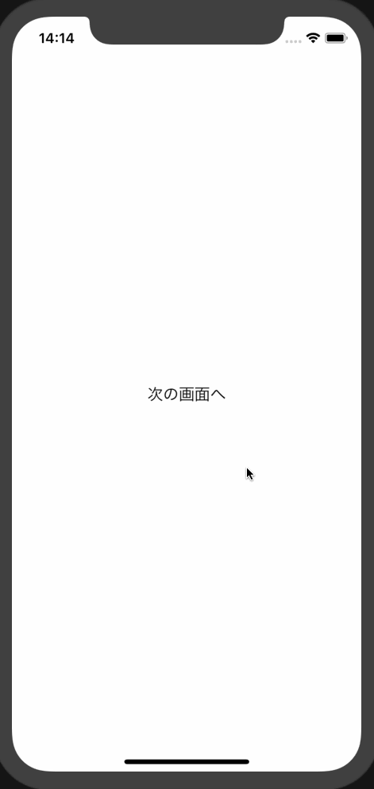

# 遷移アニメーションの超基本

## 参考資料
[View Controller Programming Guide for iOS 「トランジションアニメーションをカスタマイズする」](https://developer.apple.com/jp/documentation/featuredarticles/ViewControllerPGforiPhoneOS/CustomizingtheTransitionAnimations/CustomizingtheTransitionAnimations.html#//apple_ref/doc/uid/TP40007457-CH16-SW1)

## 遷移アニメーションの概要説明
画面遷移アニメーションを実装するにはまず、`UIViewControllerTransitioningDelegate`プロトコルに準拠した遷移デリゲートを実装する。

遷移デリゲートは、画面遷移が発生するときに、UIKitに対して以下のオブジェクトを提供する。

- アニメーターオブジェクト
- インタラクティブアニメーターオブジェクト
- Presentation Controller

遷移先のビューコントローラの`transitioningDelegate`プロパティに遷移デリゲートインスタンスを渡すと、画面遷移時に遷移デリゲートによるアニメーションが実行される。

### アニメーションのロジック
遷移元ビューコントローラの`present(_:animated:completion:)`を呼び出すと、遷移デリゲートの`animationController(forPresented:presenting:source:)`が呼ばれ、アニメーターオブジェクトが取得される。  
アニメーターオブジェクトがnilでなければ、以下のステップを実行する。

- 遷移デリゲートの`interactionControllerForPresentation(using:)`を呼び出し、インタラクティブアニメーターオブジェクトが利用可能かどうか確認する
  - インタラクティブアニメーターオブジェクトがnilであれば、ユーザ操作なしでアニメーションを開始する
- アニメーターオブジェクトの`transitionDuration(using:)`を呼び出し、アニメーションの持続時間を取得する
- インタラクティブアニメーターオブジェクトがnilかどうかで分岐
  - nilであれば、アニメーターオブジェクトの`animateTransition(using:)`を呼び出す
  - nilでなければ、インタラクティブアニメーターの`startInteractiveTransition(_:)`を呼び出す
- UIKitはアニメーターオブジェクトがコンテキスト遷移オブジェクトの`completeTransition(_:)`を呼び出すのを待ってから、遷移元ビューコントローラの`present(_:animated:completion:)`の完了ハンドラを呼び出す
- 最後に、アニメーターオブジェクトの`animationEnded(_:)`が呼ばれる

